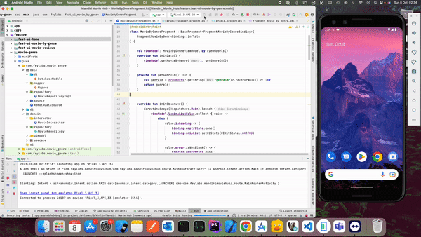

# **Mandiri Movie Hub**

Mandiri Movie Hub is an Android app tailored for movie enthusiasts, seamlessly integrating with The Movie Database (TMDb). Explore an extensive film collection with ease, catering to both novice and seasoned cinephiles. Discover, learn, and enjoy movies effortlessly through a user-friendly interface.

## Mobile Application Checklist

| No. | User Story                                                                      | Implementation Status |
|----|----------------------------------------------------------------------------------|-----------------------|
| 1. | Create a screen to display the list of official genres for movies.               | :white_check_mark:    |
| 2. | Create a screen to list discover movies by genre.                                | :white_check_mark:    |
| 3. | Show the primary information about a movie when the user clicks on the movie.     | :white_check_mark:    |
| 4. | Show the users' reviews for a movie.                                             | :white_check_mark:    |
| 5. | Show the YouTube trailer of the movie.                                           | :white_check_mark:    |
| 6. | Implement endless scrolling on the list of movies and users' reviews.            | :white_check_mark:    |
| 7. | Cover positive and negative cases.                                               | :white_check_mark:    |

## Technical Details

- **Architecture:** MVVM
- **Language:** Kotlin
- **Clean Architecture:** Yes
- **Network Requests:** Retrofit
- **Local Data Storage:** Room (including offline caching for movie genre)
- **Asynchronous Data Streams:** Kotlin Flow
- **Dependency Injection:** Dagger 2
- **Communication:** LiveData
- **UI Updates:** Data binding
- **Navigation:** Navigation Component
- **Concurrency:** Coroutines
- **Database:** Room
- **Image Loading:** Glide
- **UI/UX:** Material Design Components

- 

## Contributing

We welcome contributions! Review our guidelines and conventions before starting.

## Preview

### Guidelines

1. Fork this repository, create a new branch.
2. Changes should follow technical requirements (MVVM, Kotlin, clean architecture, etc.).
3. Write tests for changes to ensure functionality.
4. Submit a pull request with clear descriptions.